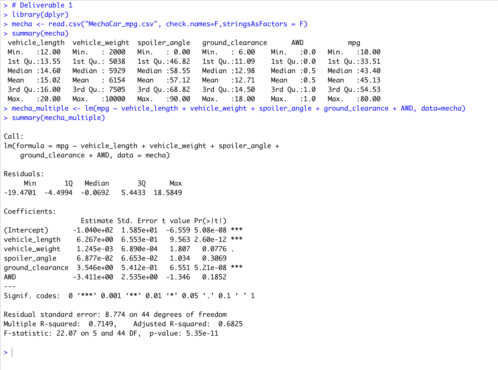
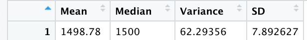
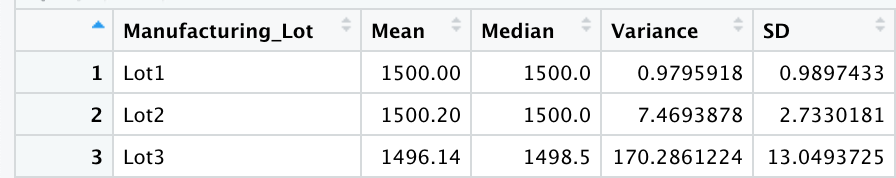
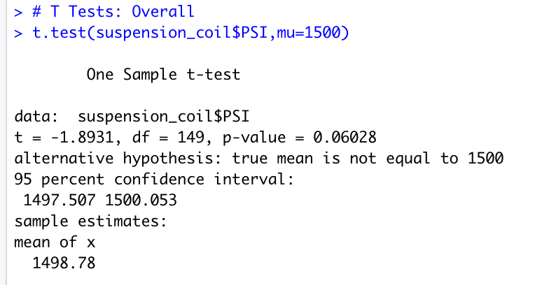
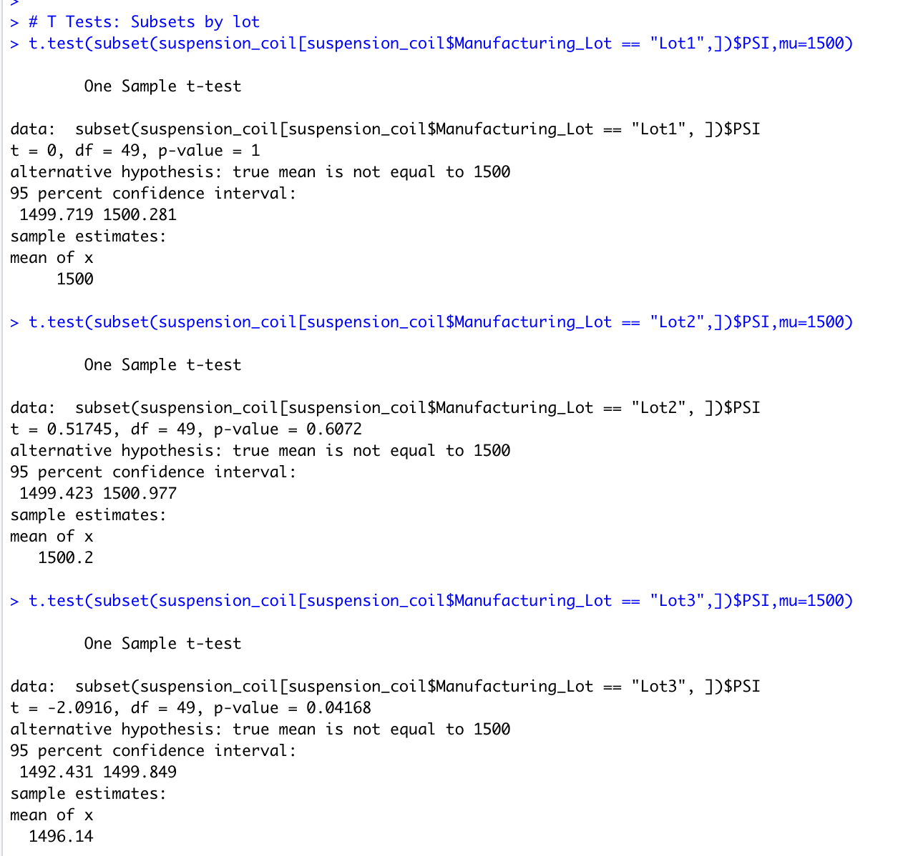

# MechaCar_Statistical_Analysis

## Linear Regression to Predict MPG
1. **Which variables/coefficients provided a non-random amount of variance to the mpg values in the dataset?**
    
    The two variables that produced a non-random amount of variance were: the vehicle length and the ground clearance. These could be considered as predictors.

2. **Is the slope of the linear model considered to be zero? Why or why not?**

    The slope of the linear model is not considered to be zero because the linear regression shows that some of the independent variables had a significant effect on the dependent variable.

3. **Does this linear model predict mpg of MechaCar prototypes effectively? Why or why not?**

    This linear model can predict the mpg of MechaCar prototypes effectively because the linear model's r-squared value is at 0.715. This means that out of 100 instances, the model was able to predict the mpg correctly around 71 times.

## Summary Statistics on Suspension Coils

**The design specifications for the MechaCar suspension coils dictate that the variance of the suspension coils must not exceed 100 pounds per square inch. Does the current manufacturing data meet this design specification for all manufacturing lots in total and each lot individually? Why or why not?**

Looking at the current design specifications and our total summary, the current variance is about 62.3 which technically meets the requirements. However, when looking particularly at each of the lots, we see that for lot 3 the variance is 170.3 which would not meet the requirements of the specifications. Because this lot does not pass it should be attended to and fixed by the management.

## T-Tests on Suspension Coils

Based on the tests to the true population mean of 1500 PSI we can see that, based on a significance level of 95% percent I was able to determine that all of the four groups' p-values were much greater than .05. This means that there is not a significant statistical difference between the four groups and the population mean.

Overall T-Test:

T-Tests by Lot:
